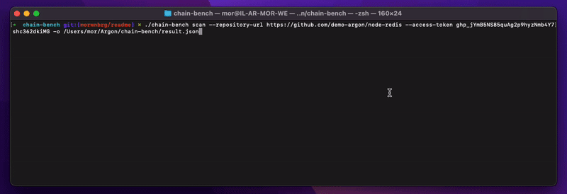

<p align="center">
<picture>
  <source media="(prefers-color-scheme: dark)" srcset="docs/imgs/banner_dm.png">
  <source media="(prefers-color-scheme: light)" srcset="docs/imgs/banner_lm.png">
  
</picture>

</p>

<p align="center">

[📖 Documentation][docs]

Chain-bench is an open-source tool for auditing your software supply chain stack for security compliance based on a new 
  <a href="docs/CIS-Software-Supply-Chain-Security-Guide-v1.0.pdf">CIS Software Supply Chain benchmark</a>.
The auditing focuses on the entire SDLC process, where it can reveal risks from code time into deploy time. To win the race against hackers and protect your sensitive data and customer trust, you need to ensure your code is compliant with your organization’s policies.

Read more in the [Chain-bench Documentation][docs]
</p>

[](https://pkg.go.dev/github.com/aquasecurity/chain-bench)
[![GitHub Release][release-img]][release]
[![Downloads][download]][release]
[![DockerHub Pulls][docker-pull-img]][docker-pull]
[](https://github.com/aquasecurity/chain-bench/actions)
[](https://github.com/aquasecurity/chain-bench/blob/main/LICENSE)
[![go-report-card][go-report-card]](https://goreportcard.com/report/github.com/aquasecurity/chain-bench)

<!--  -->

[download]: https://img.shields.io/github/downloads/aquasecurity/chain-bench/total?logo=github&style=flat-square
[release-img]: https://img.shields.io/github/release/aquasecurity/chain-bench.svg?logo=github&style=flat-square
[release]: https://github.com/aquasecurity/chain-bench/releases
[docker-pull]: https://cloud.docker.com/repository/docker/aquasec/chain-bench
[docker-pull-img]: https://img.shields.io/docker/pulls/aquasec/chain-bench.svg
[go-report-card]: https://goreportcard.com/badge/github.com/aquasecurity/chain-bench?style=flat-square

<figure style="text-align: center">
  
</figure>

# Contents

- [Contents](#contents)
- [Introduction](#introduction)
- [Quick start](#quick-start)
  - [Installation](#installation)
  - [Usage](#usage)
    - [Using docker](#using-docker)
    - [Using GitHub Actions](#using-github-actions)
    - [Using Gitlab CI (beta)](#using-gitlab-ci-beta)
- [Requirements](#requirements)
- [Supported Providers](#supported-providers)
- [Please Note](#please-note)
- [Contributing](#contributing)
- [Roadmap](#roadmap)

# Introduction

Chain-bench is an open-source tool for auditing your software supply chain stack for security compliance based on a new [CIS Software Supply Chain benchmark](/docs/CIS-Software-Supply-Chain-Security-Guide-v1.0.pdf).
The auditing focuses on the entire SDLC process, where it can reveal risks from code time into deploy time.

# Quick start

The primary way to run chain-bench is as a standalone cli. It requires an access token for your account and the repository url in order to access your SCM.

## Installation

Get Chain-bench via your favorite installation method. See [installation] section in the documentation for details. For example:

- `brew install chain-bench`
- `nix-env --install -A nixpkgs.chain-bench`
- `docker run aquasec/chain-bench`
- Download binary from https://github.com/aquasecurity/chain-bench/releases/latest/

## Usage

```bash
chain-bench scan --repository-url <REPOSITORY_URL> --access-token <TOKEN> -o <OUTPUT_PATH>
```

### Using Self-hosted or Dedicated SCM Platforms (with custom domains)

```bash
chain-bench scan --repository-url <REPOSITORY_URL> --scm-platform <SCM_PLATFORM> --access-token <TOKEN> -o <OUTPUT_PATH>
```

Supported options for `scm-platform` are `"github"` and `"gitlab"` (beta)

### Using docker

```bash
docker run aquasec/chain-bench scan --repository-url <REPOSITORY_URL> --access-token <TOKEN>
```

### Using GitHub Actions

See the repository at https://github.com/aquasecurity/chain-bench-action

<details>
<summary>Example output</summary>

```
2022-06-13 15:22:18 INF 🚩	Fetch Starting
2022-06-13 15:22:19 INF 🏢	Fetching Organization Settings Finished
2022-06-13 15:22:29 INF 🛢️	Fetching Repository Settings Finished
2022-06-13 15:22:29 INF 🌱	Fetching Branch Protection Settings Finished
2022-06-13 15:22:29 INF 👫	Fetching Members Finished
2022-06-13 15:22:31 INF 🔧	Fetching Pipelines Finished
2022-06-13 15:22:31 INF 🏁	Fetch succeeded
   ID                                                 Name                                                Result                  Reason
-------- ----------------------------------------------------------------------------------------------- -------- ---------------------------------------
 1.1.3    Ensure any change to code receives approval of two strongly authenticated users                 Passed
 1.1.4    Ensure previous approvals are dismissed when updates are introduced to a code change proposal   Failed
 1.1.5    Ensure that there are restrictions on who can dismiss code change reviews                       Failed
 1.1.6    Ensure code owners are set for extra sensitive code or configuration                            Failed
 1.1.8    Ensure inactive branches are reviewed and removed periodically                                  Failed   20 inactive branches
 1.1.9    Ensure all checks have passed before the merge of new code                                      Passed
 1.1.10   Ensure open git branches are up to date before they can be merged into codebase                 Passed
 1.1.11   Ensure all open comments are resolved before allowing to merge code changes                     Passed
 1.1.12   Ensure verifying signed commits of new changes before merging                                   Failed
 1.1.13   Ensure linear history is required                                                               Passed
 1.1.14   Ensure branch protection rules are enforced on administrators                                   Failed
 1.1.15   Ensure pushing of new code is restricted to specific individuals or teams                       Passed
 1.1.16   Ensure force pushes code to branches is denied                                                  Failed
 1.1.17   Ensure branch deletions are denied                                                              Failed
 1.2.1    Ensure all public repositories contain a SECURITY.md file                                       Failed
 1.2.2    Ensure repository creation is limited to specific members                                       Failed
 1.2.3    Ensure repository deletion is limited to specific members                                       Passed
 1.2.4    Ensure issue deletion is limited to specific members                                            Passed
 1.3.1    Ensure inactive users are reviewed and removed periodically                                     Failed   22 inactive users
 1.3.3    Ensure minimum admins are set for the organization                                              Passed
 1.3.5    Ensure the organization is requiring members to use MFA                                         Passed
 1.3.7    Ensure 2 admins are set for each repository                                                     Failed
 1.3.8    Ensure strict base permissions are set for repositories                                         Passed
 1.3.9    Ensure an organization's identity is confirmed with a Verified badge                            Failed
 2.3.1    Ensure all build steps are defined as code                                                      Failed   No build job was found in pipelines
 2.3.5    Ensure access to the build process's triggering is minimized                                    Passed
 2.3.7    Ensure pipelines are automatically scanned for vulnerabilities                                  Passed
 2.3.8    Ensure scanners are in place to identify and prevent sensitive data in pipeline files           Failed   Repository is not scanned for secrets
 2.4.2    Ensure all external dependencies used in the build process are locked                           Failed   16 task(s) are not pinned
 2.4.6    Ensure pipeline steps produce an SBOM                                                           Passed
 3.1.7    Ensure dependencies are pinned to a specific, verified version                                  Failed   16 dependencies are not pinned
 3.2.2    Ensure packages are automatically scanned for known vulnerabilities                             Passed
 3.2.3    Ensure packages are automatically scanned for license implications                              Passed
 4.2.3    Ensure user's access to the package registry utilizes MFA                                       Passed
 4.2.5    Ensure anonymous access to artifacts is revoked                                                 Passed
 4.3.4    Ensure webhooks of the package registry are secured                                             Passed
-------- ----------------------------------------------------------------------------------------------- -------- ---------------------------------------
 Total Passed Rules: 19 out of 36
2022-06-13 15:22:31 INF Scan completed: 13.108s
```
</details>


### Using Gitlab CI (beta)

You can integrated chain-bench results into [Gitlab Vulnrability Report](https://docs.gitlab.com/ee/user/application_security/vulnerability_report/) by adding a new step within your CI defintion:
```
chain-bench-scanning:
  stage: test
  image:
    name: docker.io/aquasec/chain-bench
    entrypoint: [""]
  script:
    - chain-bench scan --repository-url $CI_PROJECT_URL --access-token $CHAIN_BENCH_TOKEN --scm-platform gitlab -o results.json --template @/templates/gitlab_security_scanner.tpl
  artifacts:
    reports:
      container_scanning: results.json
```
* You have to create new [token](https://docs.gitlab.com/ee/user/project/settings/project_access_tokens.html) with `Maintainer` role that has `read_api` & `read_repository` permission and use it as environment variables (eg. $CHAIN_BENCH_TOKEN)


# Requirements

It is required to provide an access token with permission to these scopes: `repo`(all), `read:repo_hook`, `admin:org_hook`, `read:org`

# Supported Providers

We currently support Github and Gitlab SCMs, with PAT authentication.

# Please Note

Chain-bench implements the CIS Software Supply Chain Benchmark as closely as possible.
You can find the current implemented checks under [AVD - Software Supply Chain CIS - 1.0](https://avd.aquasec.com/compliance/softwaresupplychain/cis-1.0/) that update every night based chain-bench metadata.json files
Please raise issues here if chain-bench is not correctly implementing the test as described in the Benchmark. To report issues in the Benchmark itself (for example, tests that you believe are inappropriate), please join the CIS community.

# Contributing

Kindly read [Contributing](CONTRIBUTING.md) before contributing.
We welcome PRs and issue reports.

# Roadmap

Going forward we plan to release updates to chain-bench to increase the benchmark coverage with more checks and support more platforms.
chain-bench is an Aqua Security open source project part of Trivy Family.

[docs]: https://github.com/aquasecurity/chain-bench/blob/main/docs/
[installation]: https://github.com/aquasecurity/chain-bench/blob/main/docs/getting-started/installation.md
<!-- TODO: swap to GH pages
[docs]: https://aquasecurity.github.io/chain-bench
[installation]: https://aquasecurity.github.io/chain-bench/latest/docs/getting-started/installation/
-->
