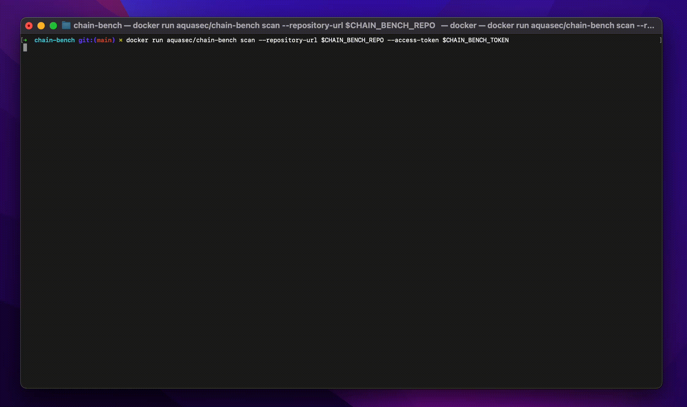

---
hide:
- navigation
- toc
---

<!-- { align=left } -->

Chain-bench is an open-source tool for auditing your software supply chain stack for security compliance based on a new CIS Software Supply Chain benchmark.
The auditing focuses on the entire SDLC process, where it can reveal risks from code time into deploy time. To win the race against hackers and protect your sensitive data and customer trust, you need to ensure your code is compliant with your organization’s policies.

  <h1 id="demo">Demo</h1>

<figure style="text-aligh: center">
  
  <figcaption>Demo: Vulnerability Detection</figcaption>
</figure>

---

Chain-bench is an [Aqua Security][aquasec] open source project.  
Learn about our open source work and portfolio [here][oss].  
Contact us about any matter by opening a GitHub Discussion [here][discussions]

[aquasec]: https://aquasec.com
[oss]: https://www.aquasec.com/products/open-source-projects/
[discussions]: https://github.com/aquasecurity/chain-bench/discussions
